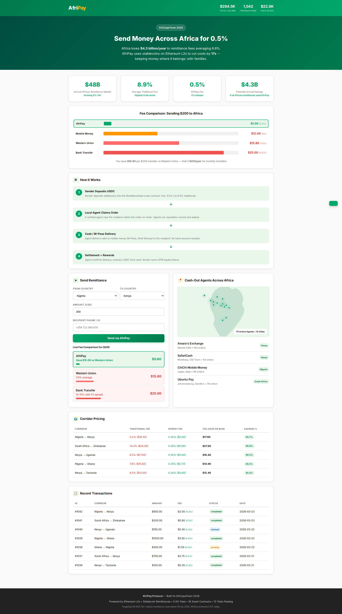
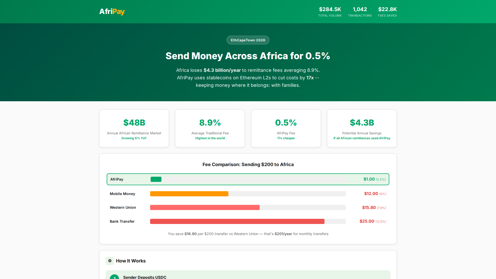
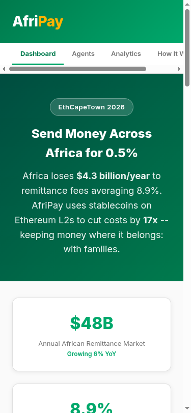
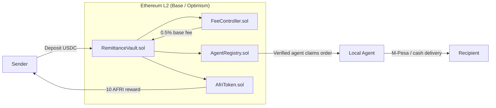
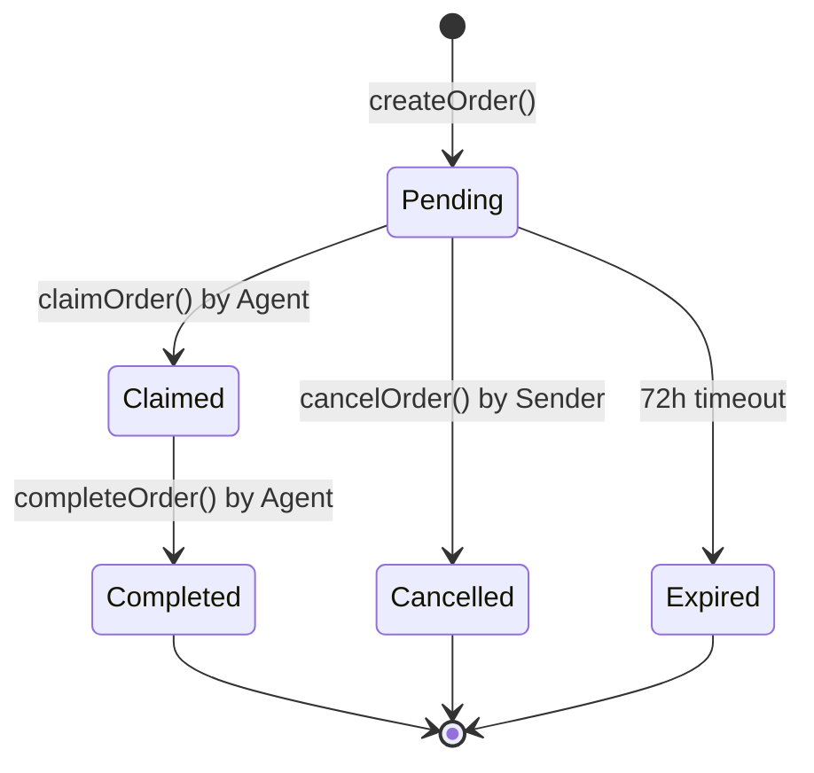
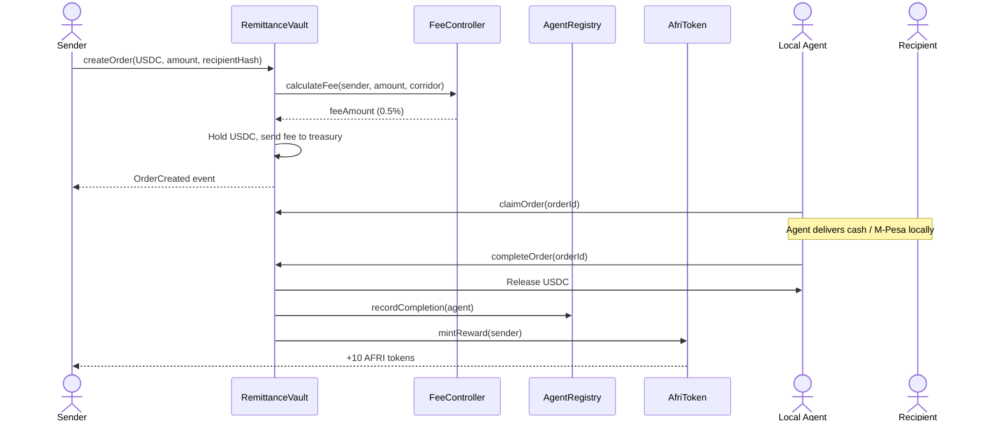

# AfriPay Protocol

**Cross-border remittance infrastructure for Africa — 0.5% fees vs 8.9% industry average.**

Built for [Synthesis 2026](https://synthesis.ai/) (Agents That Pay track). AfriPay replaces traditional correspondent banking with stablecoin settlement on Ethereum L2s, using a network of local cash-out agents with on-chain reputation.



| Hero | Mobile |
|:----:|:------:|
|  |  |

---

## Architecture



### Order Lifecycle



### Remittance Flow



---

## Features

- **0.5% fees** — 17x cheaper than Western Union's 8.9% average for African corridors
- **Stablecoin settlement** — USDC/USDT on Base L2 with sub-cent gas costs
- **Local agent network** — M-Pesa-style cash-out agents across 14 African cities
- **Dynamic fee engine** — corridor-specific pricing + volume discounts (down to 0.25%)
- **On-chain reputation** — agents build verifiable track records via completion rate and volume
- **AFRI loyalty token** — 10 AFRI per remittance for fee discounts and governance
- **Privacy-preserving** — recipient identified by hashed phone/ID, not plaintext
- **72-hour expiry** — unclaimed orders auto-expire with sender refund protection

---

## Cost Comparison

| Transfer Amount | Western Union (8.9%) | AfriPay (0.5%) | Savings |
|:-:|:-:|:-:|:-:|
| $50 | $4.45 | $0.25 | $4.20 |
| $200 | $17.80 | $1.00 | $16.80 |
| $500 | $44.50 | $2.50 | $42.00 |
| $1,000 | $89.00 | $5.00 | $84.00 |

---

## Quick Start

### Prerequisites

- Node.js >= 18
- Git

### Install & Test

```bash
git clone https://github.com/Akasxh/afripay-protocol.git
cd afripay-protocol

npm install
npx hardhat compile
npx hardhat test          # 13 tests covering full remittance lifecycle
```

### Local Development

```bash
# Terminal 1
npx hardhat node

# Terminal 2
npx hardhat run scripts/deploy.js --network localhost
```

### Run the Demo Frontend

```bash
open frontend/index.html
# or
python3 -m http.server 8080 -d frontend/
```

### Deploy to Testnet

```bash
export PRIVATE_KEY=your_deployer_key
export SEPOLIA_RPC_URL=https://sepolia.base.org

npx hardhat run scripts/deploy.js --network sepolia
```

---

## Project Structure

```
afripay-protocol/
├── contracts/
│   ├── RemittanceVault.sol      # Core vault: deposits, order lifecycle, agent payouts
│   ├── FeeController.sol        # Dynamic fees: 0.5% base, volume discounts, corridor pricing
│   ├── AgentRegistry.sol        # Agent onboarding, reputation, country-based discovery
│   ├── AfriToken.sol            # ERC20 loyalty token (100M supply)
│   └── interfaces/
│       └── IRemittanceVault.sol
├── scripts/
│   └── deploy.js
├── test/
│   └── Remittance.test.js       # 13 tests
├── frontend/
│   ├── index.html               # Multi-tab dashboard
│   ├── style.css
│   └── app.js                   # Wallet connection, analytics, agent leaderboard
├── screenshots/
├── hardhat.config.js
├── docker-compose.yml
├── Dockerfile
├── Makefile
└── package.json
```

---

## Tech Stack

| Component | Technology |
|-----------|-----------|
| Smart Contracts | Solidity 0.8.20, OpenZeppelin v5 |
| Development | Hardhat, ethers.js |
| Network | Base / Optimism (Ethereum L2) |
| Stablecoins | USDC, USDT, DAI |
| Frontend | Vanilla HTML/CSS/JS |
| Containerization | Docker, docker-compose |

---

## Smart Contract Design

| Contract | Responsibility |
|----------|---------------|
| **RemittanceVault** | Holds stablecoin deposits. Orders flow through `Pending -> Claimed -> Completed`. Uses `ReentrancyGuard` and `SafeERC20`. |
| **FeeController** | Tiered fee system — high-volume senders get discounts (0.5% -> 0.25%). Corridor-specific pricing with floor/ceiling enforcement. |
| **AgentRegistry** | Local cash-out agents register with country, location, and stake. On-chain reputation tracks completion rate and volume. |
| **AfriToken** | ERC20 with 100M supply. Senders earn 10 AFRI per remittance. Future: fee discounts, governance, agent staking. |

---

## Contributing

1. Fork the repository
2. Create a feature branch: `git checkout -b feature/my-feature`
3. Run tests: `npx hardhat test`
4. Commit with conventional commits: `feat(vault): add multi-token support`
5. Open a pull request against `main`

---

## License

[MIT](./LICENSE)
