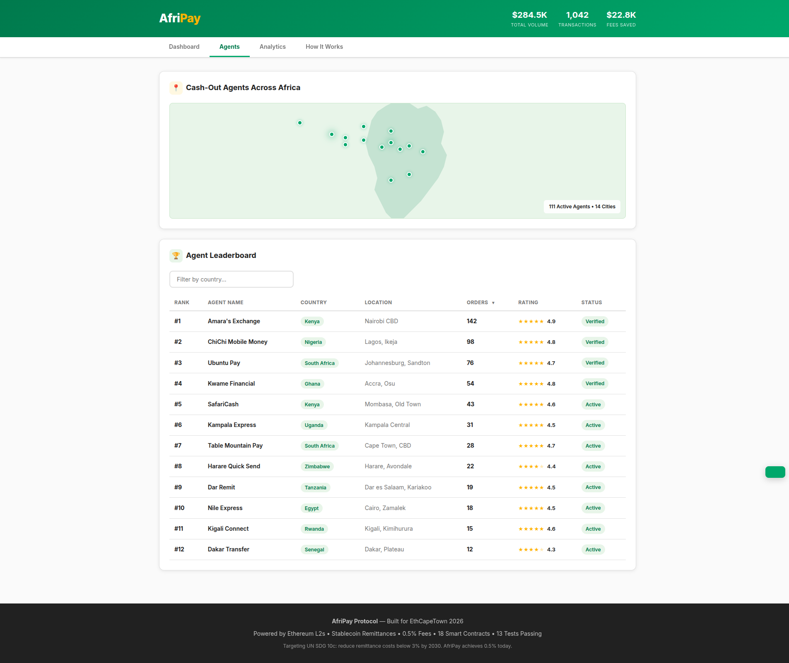
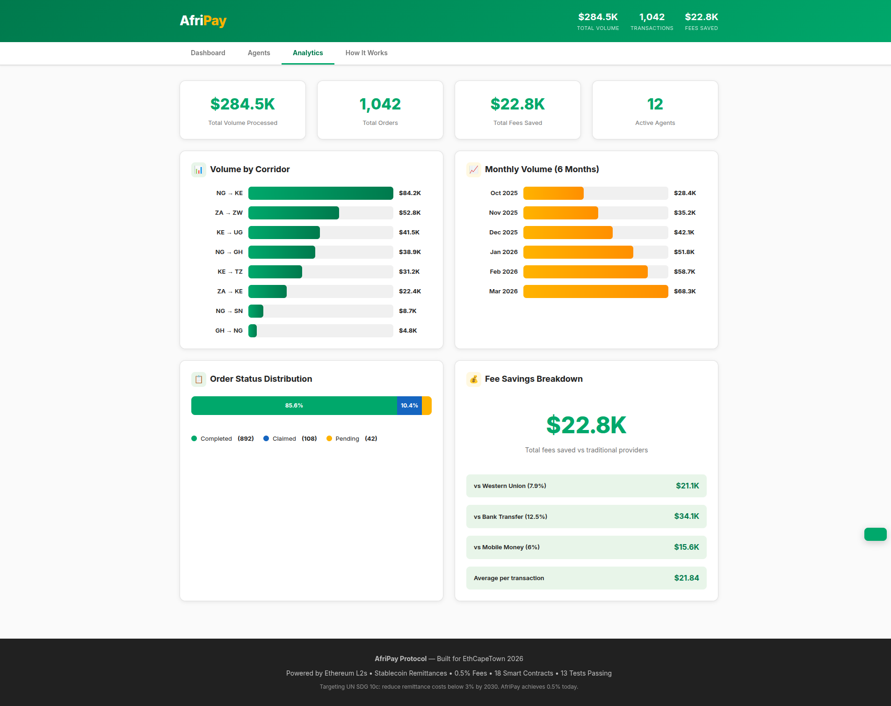
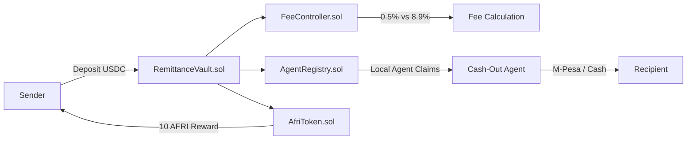
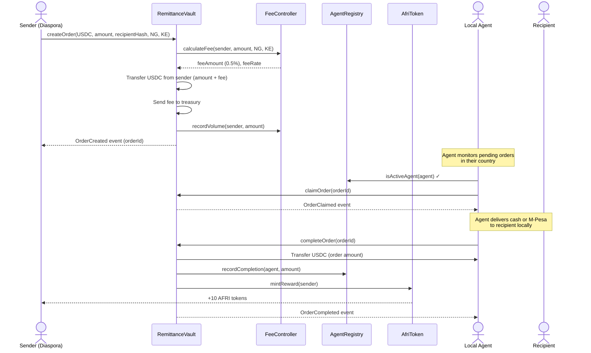
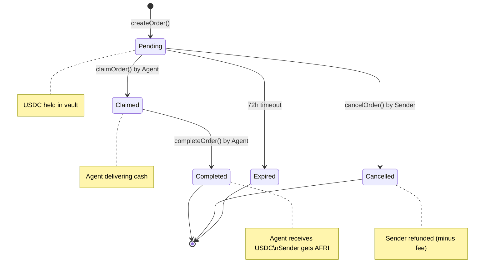

# AfriPay -- Cross-Border Remittance Protocol for Africa

**Synthesis 2026 — Agents That Pay**

AfriPay is agentic infrastructure for cross-border payments. Local cash-out agents are autonomous economic actors with on-chain reputation, spending scopes, and settlement — the core vision of Synthesis's "Agents That Pay" track.

## The Problem

Africa's remittance market is worth **$48 billion annually** and growing 6% year-over-year -- yet African corridors carry the **highest remittance fees in the world at 8.9% on average** (World Bank, 2024). Sub-Saharan Africa is even worse at **over 9.4%**.

For a family in Nairobi waiting on $200 from a relative in Lagos, **$17.80 disappears to intermediaries** before the money even arrives. Multiply that across the continent: **$4.3 billion lost to fees every year** -- money that could pay school fees, cover medical bills, or start small businesses.

The UN SDG 10c target calls for remittance fees below 3% by 2030. Africa is nowhere close. Traditional providers extract value at every step: FX spreads, correspondent banking fees, agent commissions, and compliance surcharges.

| Provider | Average Fee | Cost to Send $200 | Cost to Send $500 | Settlement Time |
|----------|------------|-------------------|--------------------|-----------------|
| Western Union | 7.9% | $15.80 | $39.50 | 1-3 days |
| Bank Transfer | 10-15% | $20-30 | $50-75 | 3-5 business days |
| Mobile Money (cross-border) | 5-8% | $10-16 | $25-40 | 1-2 days |
| **AfriPay** | **0.5%** | **$1.00** | **$2.50** | **Minutes** |

## Features

- **0.5% fees** -- 17x cheaper than Western Union's 8.9% average for African corridors
- **Stablecoin settlement** -- USDC/USDT on Base L2 with sub-cent gas costs
- **Local agent network** -- M-Pesa-style cash-out agents across 14 African cities
- **Dynamic fee engine** -- corridor-specific pricing + volume discounts (down to 0.25%)
- **On-chain reputation** -- agents build verifiable track records via completion rate and volume
- **AFRI loyalty token** -- senders earn 10 AFRI per remittance for fee discounts and governance
- **Privacy-preserving** -- recipient identified by hashed phone/ID, not plaintext
- **72-hour expiry** -- unclaimed orders auto-expire with sender refund protection

## The Solution

AfriPay is a **stablecoin-based remittance protocol** deployed on Ethereum L2s (Base, Optimism) that:

1. **Eliminates intermediary banks** -- direct peer-to-protocol-to-agent settlement
2. **Uses stablecoins** (USDC/USDT) -- no FX spread, no correspondent banking fees
3. **Leverages L2s** -- gas costs under $0.01 per transaction
4. **Incentivizes local agents** -- M-Pesa-style cash-out network with on-chain reputation

### How It Works

```
                         AfriPay Protocol
                         ================

  SENDER (Diaspora)                              RECIPIENT (Home Country)
  ==================                             =======================
        |                                              |
   [1]  |-- Deposits USDC into RemittanceVault ------->|
        |   (0.5% fee vs 8.9% traditional)             |
        |                                              |
        |            +-------------------+              |
        |            | RemittanceVault   |              |
        |            | - Holds USDC      |              |
        |            | - Calculates fees |              |
        |            | - Manages orders  |              |
        |            +-------------------+              |
        |                     |                         |
   [2]  |   FeeController     |   AgentRegistry        |
        |   - 0.5% base fee   |   - Verified agents    |
        |   - Volume discounts|   - On-chain reputation |
        |   - Corridor pricing|   - Country-based       |
        |                     |                         |
   [3]  |              Agent claims order               |
        |                     |                    [LOCAL AGENT]
        |                     |                    Delivers cash /
        |                     |                    M-Pesa / mobile
        |                     |                    money to recipient
        |                     |                         |
   [4]  |              Agent confirms delivery          |
        |              Receives USDC from vault         |
        |                                              |
   [5]  |   Sender earns AFRI reward tokens             |
        |   (loyalty + future governance)               |
```

### Per-Transaction Savings

| Transfer Amount | Traditional Fee (8.9%) | AfriPay Fee (0.5%) | You Save | Savings % |
|----------------|----------------------|-------------------|----------|-----------|
| $50 | $4.45 | $0.25 | **$4.20** | 94.4% |
| $200 | $17.80 | $1.00 | **$16.80** | 94.4% |
| $500 | $44.50 | $2.50 | **$42.00** | 94.4% |
| $1,000 | $89.00 | $5.00 | **$84.00** | 94.4% |
| $5,000 | $445.00 | $25.00 | **$420.00** | 94.4% |

A family receiving $200/month saves **$201.60/year** -- enough for a semester of school fees in many African countries.

## Screenshots

| Dashboard | Agent Network | Analytics |
|-----------|--------------|-----------|
|  |  |  |

| Hero | Mobile View |
|------|-------------|
|  |  |

## Architecture



### Remittance Flow — Sequence Diagram



### Order State Machine



### Contract Structure

```
contracts/
  RemittanceVault.sol  -- Core vault: deposits, order lifecycle, agent payouts
  FeeController.sol    -- Dynamic fees: 0.5% base, volume discounts, corridor pricing
  AgentRegistry.sol    -- Agent onboarding, reputation, country-based discovery
  AfriToken.sol        -- ERC20 loyalty token: rewards for senders, governance
  interfaces/
    IRemittanceVault.sol
```

### Smart Contract Design

- **RemittanceVault**: Holds stablecoin deposits. Orders flow through `Pending -> Claimed -> Completed` states. Agents claim orders, deliver cash locally, then confirm on-chain to receive stablecoins. Uses OpenZeppelin's `ReentrancyGuard` and `SafeERC20`.
- **FeeController**: Tiered fee system -- high-volume senders get discounts (0.5% -> 0.25%). Corridor-specific pricing (Nigeria->Kenya is cheaper than average). Floor/ceiling enforcement.
- **AgentRegistry**: Local cash-out agents register with country, location, and stake. On-chain reputation tracks completion rate and volume.
- **AfriToken (AFRI)**: 100M supply. Senders earn 10 AFRI per remittance. Future utility: fee discounts, governance votes, agent staking.

## Impact Metrics

| Metric | Value |
|--------|-------|
| Fee reduction | **17x cheaper** than Western Union |
| Target market | $48B annual African remittance market |
| Potential annual savings | **$4.3B** if all African remittances used AfriPay |
| Settlement time | **Minutes** vs 3-5 business days |
| Minimum transfer | **$1** (vs $20+ for banks) |
| Financial inclusion | Serves the 57% of sub-Saharan Africans who are unbanked |
| Agent job creation | Local cash-out network across 8+ countries |

## Key Corridors -- Quantified Savings

| Corridor | Traditional Fee | AfriPay Fee | Savings per $200 | Annual Volume | Annual Savings Potential |
|----------|----------------|-------------|-------------------|---------------|------------------------|
| Nigeria -> Kenya | 9.2% | 0.40% | **$17.60** ($18.40 vs $0.80) | $3.2B | **$281M** |
| South Africa -> Zimbabwe | 14.4% | 0.45% | **$27.90** ($28.80 vs $0.90) | $1.8B | **$251M** |
| Kenya -> Uganda | 8.5% | 0.30% | **$16.40** ($17.00 vs $0.60) | $0.9B | **$73.8M** |
| Nigeria -> Ghana | 7.8% | 0.35% | **$14.90** ($15.60 vs $0.70) | $1.4B | **$104M** |
| Kenya -> Tanzania | 6.5% | 0.30% | **$12.40** ($13.00 vs $0.60) | $0.7B | **$43.4M** |
| **Total across 5 corridors** | | | | **$8.0B** | **$753M** |

The South Africa -> Zimbabwe corridor is the most exploitative at 14.4% -- a worker in Johannesburg sending $200 home to Harare pays $28.80 in fees via traditional providers. With AfriPay, that drops to $0.90. Over a year of monthly remittances, that family saves **$335** -- more than a month's rent in Harare.

## Tech Stack

- **Solidity ^0.8.20** -- 18 smart contracts with OpenZeppelin v5
- **Hardhat** -- Development, testing (13 tests), deployment
- **Ethereum L2** -- Base / Optimism for sub-cent gas
- **Stablecoins** -- USDC, USDT, DAI support
- **HTML/CSS/JS** -- Interactive demo frontend

## Getting Started

### Prerequisites

- Node.js >= 18 or Bun
- Git

### Installation

```bash
# Clone the repository
git clone https://github.com/Akasxh/afripay-protocol.git
cd afripay-protocol

# Install dependencies
npm install
# or
bun install
```

### Compile Contracts

```bash
npx hardhat compile
# Compiles 18 Solidity contracts
```

### Run Tests

```bash
npx hardhat test
# Runs 13 tests covering:
#   - Fee calculation (base fees, corridor-specific, volume discounts)
#   - Agent registration and management
#   - Full remittance flow (create -> claim -> complete)
#   - Order cancellation and refunds
#   - Protocol stats tracking
#   - Access control (minter restrictions, agent validation)
```

### Local Development

```bash
# Terminal 1: Start local Hardhat node
npx hardhat node

# Terminal 2: Deploy contracts locally
npx hardhat run scripts/deploy.js --network localhost
```

### Deploy to Testnet

```bash
# Set environment variables
export PRIVATE_KEY=your_deployer_private_key
export SEPOLIA_RPC_URL=https://sepolia.base.org  # Base Sepolia

# Deploy to Base Sepolia
npx hardhat run scripts/deploy.js --network sepolia
```

### Run the Demo Frontend

```bash
# Open in browser (no build step needed)
open frontend/index.html
# or
python3 -m http.server 8080 -d frontend/
```

## Why This Matters for Africa

1. **Financial inclusion**: 57% of sub-Saharan Africans are unbanked. AfriPay only needs a phone number -- no bank account required.
2. **Diaspora impact**: The African diaspora sends ~$48B home annually. Cutting fees from 8.9% to 0.5% keeps **$4B+ in African families' pockets** every year.
3. **Agent economy**: Creates sustainable income for local cash-out agents across the continent -- similar to M-Pesa's transformative agent model.
4. **M-Pesa integration path**: Africa already has the world's most advanced mobile money infrastructure. AfriPay agents bridge on-chain stablecoins to local mobile money rails.
5. **UN SDG alignment**: Directly addresses SDG 10c (reduce remittance costs to below 3% by 2030). AfriPay achieves **0.5%** today.

## Team

Built for Synthesis 2026.

## License

MIT
